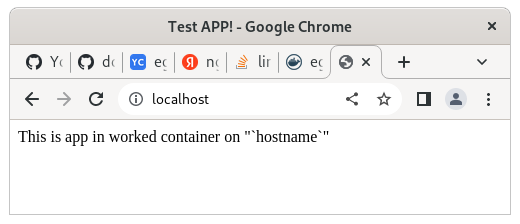

#Пример docker контейнера для диплома
```
iva@c9v:~/Documents/docker-repo/fordocker  (main)$ docker build -t egerpro/nginx-app:1.0.1 .
Sending build context to Docker daemon  4.096kB
Step 1/6 : FROM nginx:stable
 ---> 064bc46e6ff9
Step 2/6 : RUN mkdir /var/wwww
 ---> Using cache
 ---> 40d51b136ea7
Step 3/6 : COPY nginx.conf /etc/nginx/nginx.conf
 ---> Using cache
 ---> d5230bfb5957
Step 4/6 : COPY index.html /var/www/
 ---> Using cache
 ---> 13f2c02ebd21
Step 5/6 : EXPOSE 80
 ---> Using cache
 ---> 710ce4c3588b
Step 6/6 : CMD ["/usr/sbin/nginx", "-g", "daemon off;"]
 ---> Using cache
 ---> 0646052ad770
Successfully built 0646052ad770
Successfully tagged egerpro/nginx-app:1.0.1

iva@c9v:~/Documents/docker-repo/fordocker  (main)$ docker run --name test-page -p 80:80 -d egerpro/nginx-app:1.0.1
b0ddb344217177f4ed7112b5d9e80e9dd2b96a4896342da9ededc0a04660a7cf
iva@c9v:~/Documents/docker-repo/fordocker  (main)$ 
iva@c9v:~/Documents/docker-repo  (main)$ docker login
Authenticating with existing credentials...
WARNING! Your password will be stored unencrypted in /home/iva/.docker/config.json.
Configure a credential helper to remove this warning. See
https://docs.docker.com/engine/reference/commandline/login/#credentials-store

Login Succeeded
iva@c9v:~/Documents/MyOld/13Docker $ docker push egerpro/nginx-app:1.0.1 
The push refers to repository [docker.io/egerpro/nginx-app]
2ce9401f192d: Pushed 
439555fb75fb: Pushed 
f469583183af: Pushed 
7759a7a1358f: Mounted from library/nginx 
f1585a450dc4: Mounted from library/nginx 
7f5f19f09015: Mounted from library/nginx 
bf2b6fb1e6a9: Mounted from library/nginx 
6dc5357e2c92: Mounted from library/nginx 
67a4178b7d47: Mounted from library/nginx 
1.0.1: digest: sha256:460cb8ad7d1cd0aa4d311701b0053c9fde57bbf02eb3c9069beef34afaffe8ae size: 2191

```



plugins
rebuild